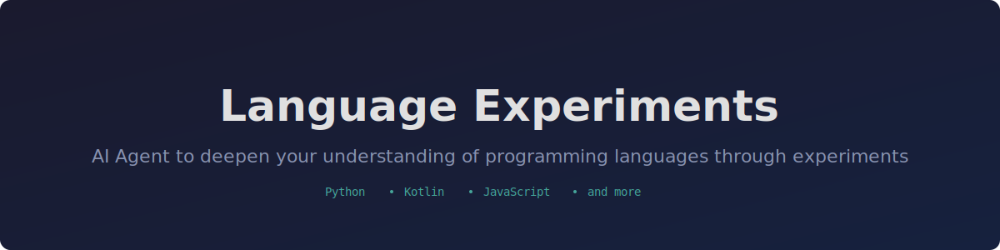

<p align="center">
  
</p>

Learn programming languages by experimenting.

Each language has its own folder with standalone experiments that reveal non-obvious, surprising, or unique behaviors — things that only become clear when you actually run the code.

## Languages

- [C](c/)
- [C++](cpp/)
- [Go](go/)
- [Java](java/)
- [JavaScript](javascript/)
- [Kotlin](kotlin/)
- [Python](python/)
- [Ruby](ruby/)
- [Rust](rust/)
- [Swift](swift/)

## How to Use

Ask Claude Code:

- `"do a new experiment in Python"` — picks an uncovered topic automatically
- `"new experiment in Kotlin on coroutines"` — targets a specific topic
- `"do a new experiment in JavaScript"` — creates a new language folder and starts experimenting

## Running Experiments

```bash
# Python
python3 python/<file>.py

# JavaScript
node javascript/<file>.js

# Kotlin
kotlinc kotlin/<file>.kt -include-runtime -d /tmp/kt_exp.jar && java -jar /tmp/kt_exp.jar

# Java
javac java/<file>.java -d /tmp/java_exp && java -cp /tmp/java_exp <ClassName>

# C
gcc -std=c17 -o /tmp/c_exp c/<file>.c && /tmp/c_exp

# C++
g++ -std=c++17 -o /tmp/cpp_exp cpp/<file>.cpp && /tmp/cpp_exp

# Go
go run go/<file>.go

# Rust
rustc rust/<file>.rs -o /tmp/rust_exp && /tmp/rust_exp

# Ruby
ruby ruby/<file>.rb

# Swift
swiftc swift/<file>.swift -o /tmp/swift_exp && /tmp/swift_exp
```

## Structure

```
<language>/
├── *.py / *.kt / ...   <- Runnable experiment scripts
└── INSIGHTS.md          <- Findings: What / Expected / Actual / Why
```
