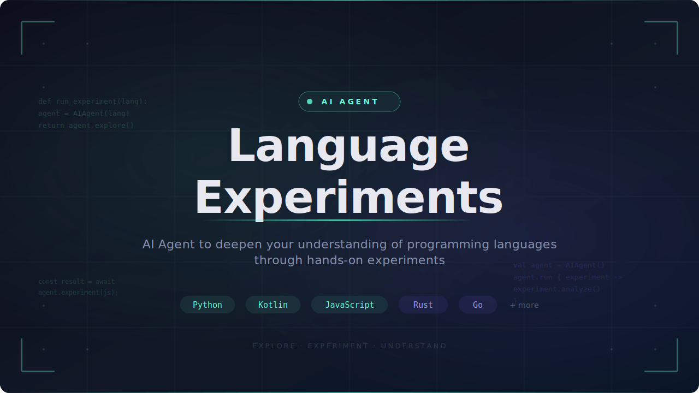

<p align="center">
  
</p>

AI Agent to deepen your understanding of programming languages through experiments.

Each language has its own folder with standalone experiments that reveal non-obvious, surprising, or unique behaviors — things that only become clear when you actually run the code.

The better the model, the deeper the experiments and insights.

> **Note:** All experiments and insights are LLM-generated. Always verify the explanations and run the experiments yourself.

## How It Works

1. Open this project in [Claude Code](https://claude.ai/code).
2. Ask the agent to experiment with a language (with or without a specific topic).
3. The agent reads all existing experiments in that language folder to avoid repetition.
4. It creates a new standalone experiment script that demonstrates a non-obvious behavior.
5. The agent runs the experiment and verifies the output.
6. The findings are appended to the language's `INSIGHTS.md` in a structured format.

## Languages

- [C](c/)
- [C++](cpp/)
- [Go](go/)
- [Java](java/)
- [JavaScript](javascript/)
- [Kotlin](kotlin/)
- [Python](python/)
- [Ruby](ruby/)
- [Rust](rust/)
- [Swift](swift/)

## Adding New Experiments

Open this project in [Claude Code](https://claude.ai/code) and ask the agent:

- `"do a new experiment in Python"` — picks an uncovered topic automatically
- `"new experiment in Kotlin on coroutines"` — targets a specific topic
- `"do a new experiment in Dart"` — creates a new language folder and starts experimenting

The agent reads existing experiments first and only creates new, non-overlapping ones. Each new experiment is run, verified, and its insights are appended to `INSIGHTS.md`.

## Structure

Each language lives in its own top-level folder:

```
language-experiments/
├── python/
│   ├── mutable_default_gotcha.py    <- Self-contained experiment script
│   ├── closure_late_binding.py
│   ├── ...
│   └── INSIGHTS.md                  <- All findings for Python
├── kotlin/
│   ├── equality_and_boxing.kt
│   ├── ...
│   └── INSIGHTS.md
├── javascript/
│   ├── type_coercion_madness.js
│   ├── ...
│   └── INSIGHTS.md
└── ... (c, cpp, go, java, ruby, rust, swift)
```

- **Experiment files** — Each file is standalone and runnable. Named descriptively after the behavior it demonstrates.
- **INSIGHTS.md** — Documents every experiment's findings in a structured format: What happened, what was expected, what actually happened, and why.

## Insight Format

Each experiment's findings are documented in `INSIGHTS.md` using this structure:

> **What**: In Java, removing the second-to-last element from an ArrayList during for-each iteration does NOT throw `ConcurrentModificationException`.
>
> **Expected**: Modifying a list during iteration always throws `ConcurrentModificationException`.
>
> **Actual**: No exception is thrown. The loop silently skips the last element — it's never visited. The internal size check passes by coincidence after removal.
>
> **Why**: The for-each loop checks `hasNext()` by comparing `cursor != size`. After removing the second-to-last element, `cursor` equals the new `size`, so the loop exits cleanly — hiding a bug instead of crashing.

## Running Experiments

### Running the Agent

Ask the agent to run and verify experiments for you.

### Running Manually

```bash
# Python
python3 python/<file>.py

# JavaScript
node javascript/<file>.js

# Kotlin
kotlinc kotlin/<file>.kt -include-runtime -d /tmp/kt_exp.jar && java -jar /tmp/kt_exp.jar

# Java
javac java/<file>.java -d /tmp/java_exp && java -cp /tmp/java_exp <ClassName>

# C
gcc -std=c17 -o /tmp/c_exp c/<file>.c && /tmp/c_exp

# C++
g++ -std=c++17 -o /tmp/cpp_exp cpp/<file>.cpp && /tmp/cpp_exp

# Go
go run go/<file>.go

# Rust
rustc rust/<file>.rs -o /tmp/rust_exp && /tmp/rust_exp

# Ruby
ruby ruby/<file>.rb

# Swift
swiftc swift/<file>.swift -o /tmp/swift_exp && /tmp/swift_exp
```

## Contributing

1. Fork this repository.
2. Add new experiments.
3. Submit a pull request.

## License

This project is licensed under the [MIT License](LICENSE).
